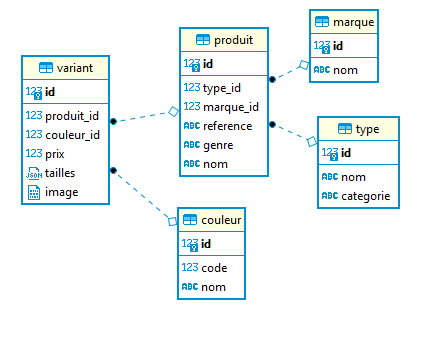

#SimpleCart
Application panier simplifié
##Contexte technique de réalisation/Test
- Apache/2.4.41
- Php 8.0.5 FPM/FastCGI
- Base de données Postgresql v12.6
- Réalisé avec Symfony 5.2.9

###Modèle relationnel
Le modèle relationnel correspondant à la base est le suivant 



Remarques :
- La catégorié (C ou T) a été ajouté comme attribut du type dans la mesure où il ne semble pas exister d'autres catégories. 
- Le champ variant.tailles est un tableau associatif json (taille:stock), et donne à la fois les tailles existantes et les stocks.
- Aucune vérification n'a été mise en place sur la base ni pour les valeurs (code pour les catégories, les genres...), ni pour les contraintes (unicité produit_id/couleur_id dans variant, ...)

Les tables ont été crées avec *Symfony Maker Bundle*.
Les données ont été ajoutées avec un client SQL (pas de fichier de migration pour les données).
Trois fichiers sont présents pour restaurer la base:
- simplecart.db-schema.psql.dump : pg_dump avec --schema-only
- simplecart.db-data.psql.dump : pg_dump avec --data-only
- simplecart.db-full.psql.dump : pg_dump complet

Par simplicité, les fichiers sont présents à la racine du projet.
##Principe
Le site comporte un menu avec 3 éléments :
- Chaussant : Produits de catégorie *Chaussant*. Il s'agit de la page par défaut
- Textile : Produits de catégorie *Textile*
- Panier : Vue du panier. Dans le menu le nb d'articles dans le panier est affiché
Chaque article correspond à un *variant* (un produit dans une couleur).

Pour chaque article lorsque l'on choisit une taille le stock s'affiche. Le bouton *ajouter* ajoute l'article par un appel ajax. L'ajout n'est possible que si le stock le permet (quantité à ajouter et quantité déjà en stock).
La vue du panier affiche la liste de tous les variants ajoutés avec la taille et la qte choisie.
Il est possible de modifier une quantité(requête ajax sur l'évenement blur), de supprimer un article ou tout le panier; le total est alors recalculé.


##Fichier host
Config du virtualhost utilisée
```
<VirtualHost *:80>
ServerName dev-www.simplecart.local
DocumentRoot /mnt/c/www/simplecart/public
    <Directory /mnt/c/www/simplecart/public>
        AllowOverride All
        Order Allow,Deny
        Allow from All
    </Directory>
</VirtualHost>
```